# Hey there 👋

  
  &nbsp;&nbsp;
  

 

## 👋 About Me

I'm Harshada Ghube from India a Computer Science student who enjoys turning ideas into working software — from small automation scripts to full applications. 

- 🎓 Computer Science and Business Student
- 🛠️ Learning & Exploring New Things
- 🌍 Open Source Contributor
- 🌐 Web Development Enthusiast
- ⚡ Late-Night Coder 
  

 

## 🧰 Tech Stack

  
  &nbsp;&nbsp;
  &nbsp;&nbsp;
  &nbsp;&nbsp;
  &nbsp;&nbsp;
  &nbsp;&nbsp;
  &nbsp;&nbsp;
  &nbsp;&nbsp;
  

 

## 🐍 Contribution Snake

 

## 📊 GitHub Stats

 

## 📫 Let's Connect

I'm always open to interesting projects, collaborations or just a good conversation about code.

 

